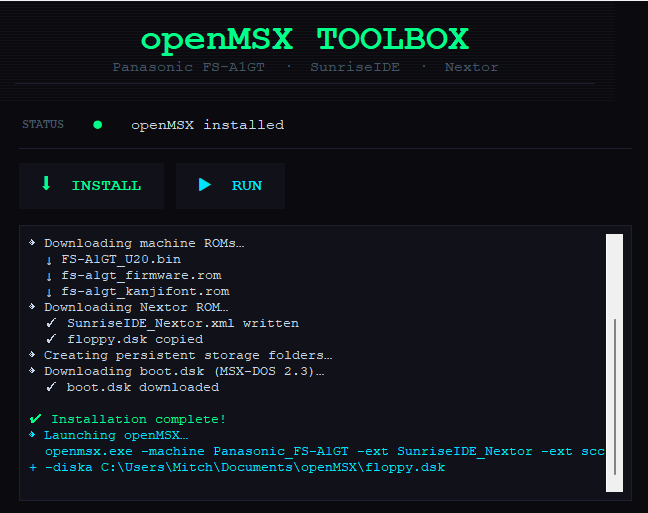

# openMSX Toolbox

> Easy installer and launcher for openMSX — built for noobs!

Getting openMSX up and running with the right machine config, ROMs, and DOS image is surprisingly painful if you've never done it before. openMSX Toolbox takes care of all of it in one click, so you can skip the steep learning curve and get straight to the fun part.

---

## What it does

- Downloads and installs the latest openMSX release for Windows (x64)
- Grabs the Panasonic FS-A1GT ROMs automatically
- Sets up the SunriseIDE extension with a Nextor ROM
- Downloads an MSX-DOS 2.3 boot disk and wires everything up
- Launches openMSX fully configured — just press Run

---

## Requirements

- Windows 10 or 11 (x64)
- Python 3.8+
- `requests` library (`pip install requests`)

---

## Getting started

1. Clone or download this repo
2. Drop the `floppy.dsk` next to the launcher (it's provided in this repo)
3. Run the launcher:

```bash
python openMSX_Toolbox.py
```

4. Hit **INSTALL** and wait for everything to download and set up
5. Once complete, hit **RUN** — that's it!

---

## What gets installed

| Component | Details |
|---|---|
| openMSX | Latest Windows release from GitHub |
| Machine | Panasonic FS-A1GT (MSX2+) |
| Extension | SunriseIDE with Nextor 2.1.1 |
| Boot disk | MSX-DOS 2.3 (100MB virtual HD) |
| Floppy disk | 720KB |
| Audio | SCC+ enabled by default |

All files are downloaded from [file-hunter.com](https://download.file-hunter.com) and the official [openMSX GitHub](https://github.com/openMSX/openMSX).

---

## Screenshot



---

## FAQ

**Do I need to own the ROMs?**
The ROMs used are freely available system ROMs distributed by the MSX community via file-hunter.com.

**Where does everything get installed?**
openMSX is installed into an `openMSX/` folder next to the launcher. The boot disk lands in your `Documents/openMSX/` folder as openMSX expects.

**Can I still configure openMSX manually?**
Yes — this tool just handles the initial setup. Once installed, openMSX works exactly as normal and you can tweak anything you like.

---

## License

MIT — do whatever you want with it.

---

*Made with ❤️ because the learning curve shouldn't be the hard part.*
